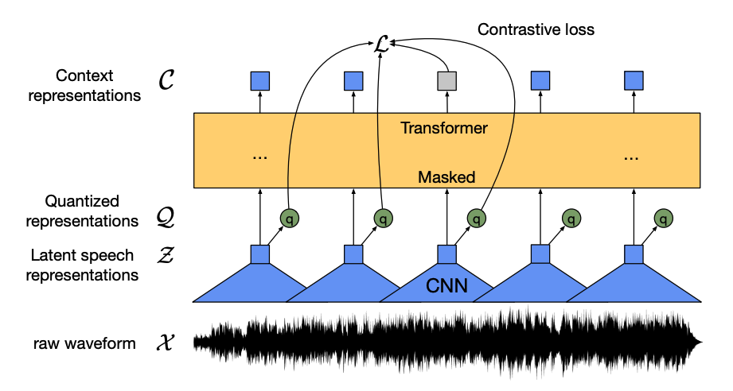

# Audio & Speech Embeddings

Audio and speech embeddings translate raw acoustic waves or spectrogram patterns into numeric vectors.

## Overview
This forms the backbone of voice recognition and sound classification (e.g., Wav2Vec).

## Diagram

