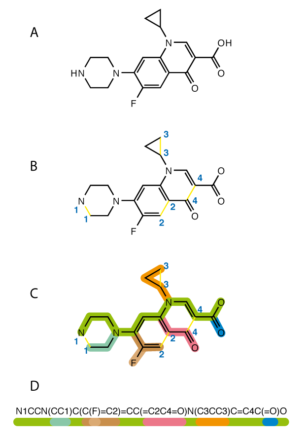

# Biological / Chemical Embeddings

Biological and chemical embeddings map amino acid chains, DNA sequences, or molecular graphs (SMILES) into vectors.

## Overview
These embeddings are used to predict molecular properties and accelerate automated drug discovery.

## Diagram

*(Note: Diagram placeholder if image failed to download)*
