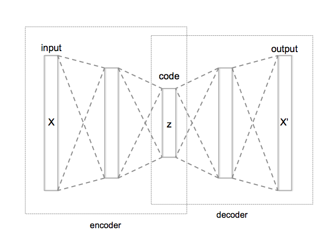

# Categorical Embeddings

Categorical embeddings map discrete relational database columns (such as User IDs, Zip Codes, or Product SKUs) into continuous vector spaces.

## Overview
This technique is used to enhance deep tabular model predictions by learning relationships between discrete categories.

## Diagram

*(Note: Diagram placeholder if image failed to download)*
