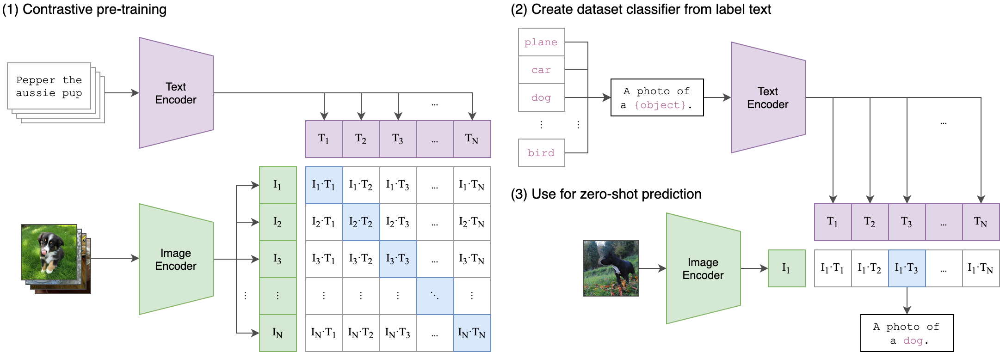

# Cross-Modal Embeddings

Cross-modal embeddings map multiple modalities (like text and images) into a single, shared vector space.

## Overview
This allows an image and its textual description to sit close together (e.g., OpenAI's CLIP).

## Diagram

