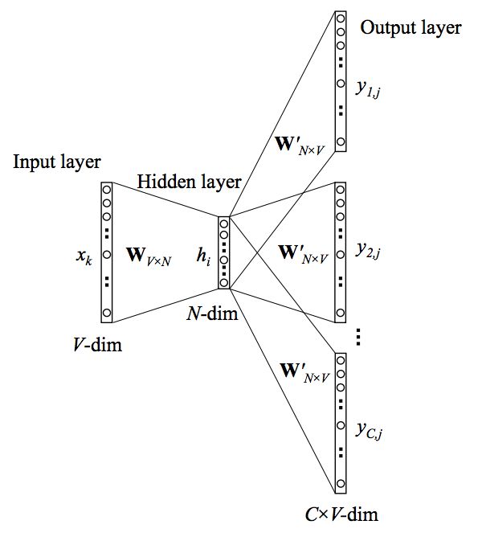

# 📑 Document Embeddings

Document embeddings vectorize long-form documents or entire articles to enable document classification and cluster analysis.

## 🚀 Overview
Examples include Doc2Vec, which extends the Word2Vec idea to represent entire documents as vectors.

## 📊 Architectural Diagram

  

---
[⬅️ Back to README](README.md)
