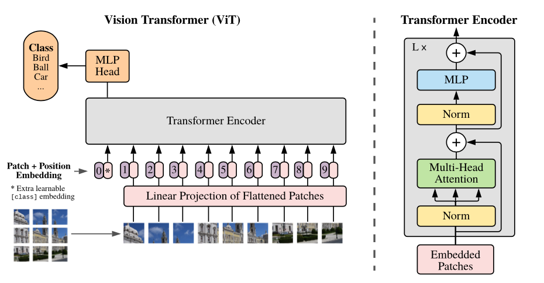

# 📸 Image Embeddings

Image embeddings extract deep visual features from images using Convolutional Neural Networks (CNNs) or Vision Transformers (ViTs), capturing textures, shapes, and semantic objects.

## 🚀 Overview
These vectors allow for image similarity search, classification, and other computer vision tasks.

## 📊 Architectural Diagram

  

---
[⬅️ Back to README](README.md)
