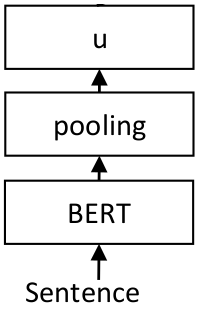

# 📜 Sentence & Paragraph Embeddings

Sentence and paragraph embeddings encode entire phrases or short texts into a single dense vector to capture semantic intent.

## 🚀 Overview
These embeddings are used to capture the meaning of longer sequences of text, often using models like Sentence-BERT (SBERT).

## 📊 Architectural Diagram

  

---
[⬅️ Back to README](README.md)
