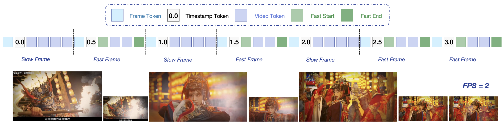

# 🎬 Video Embeddings

Video embeddings capture both spatial imagery from frames and temporal movement across time.

## 🚀 Overview
These embeddings power automated video tagging and video search engines.

## 📊 Architectural Diagram

  

---
[⬅️ Back to README](README.md)
